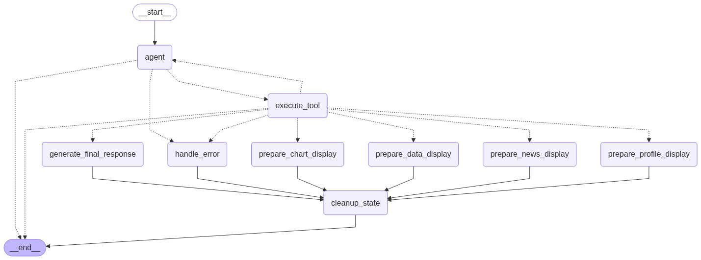

Projet OPA - Agent Analyste financier
==============================

Ce repo est un fork du projet de fin d'étude réalisé dans le cadre du cursus Data Scientist chez DataScientest et l'Ecole des Mines Paris par Mathis GENTHON

Organisation du projet
------------

    ├── LICENSE
    ├── README.md                    <- Le README décrivant le projet
    ├── .env.example                 <- Le fichier décrivant comment remplir les clefs APIs
    │
    ├── notebooks                    <- Tous les notebooks et données utilsés pendant la phase de recherche
    │   ├── csv                      <- Les données utilisées pendant le projet.
    │   └── Mathis                   <- Le travail de recherche effectué par Mathis GENTHON, convention 'OPA#X' pour l'ordre de recherche
    │
    ├── models                       <- Les modèles finaux entraînés
    │
    ├── reports                      <- Les rapports produits pour la présentation du projet
    │   └── figures                  <- Les graphiques générés lors de la phase d'exploration des données
    │
    ├── agent                        <- Le code source de l'agent analyste 
    │   ├── app.py                   <- Le fichier streamlit utilisé pour lancer l'agent 
    │   ├── agent.py                 <- La logique agentique dévéloppée dans le framework LangGraph
    │   ├── tools.py                 <- La fichier référençant les outils disponibles pour l'agent 
    │   ├── agent_workflow.png       <- Visualisation des noeuds et relations du LangGraph de l'agent
    │   ├── requirements.txt         <- Le fichier txt permettant d'installer les dépendances
    │   │
    │   ├── src                      <- Le dossier contenant les scripts des outils
    │   ├── pages                    <- Le dossier contenant les différentes pages de l'application 
    │   ├── assets                   <- Le dossier contenant les assets nécessaires à l'UI de l'application 
    │   └── .streamlit               <- Le dossier contenant les fichiers de configuration pour Streamlit

    
--------

Liste des outils et capacités de l'agent
------------
1. `search_ticker`: Recherche le ticker boursier d'une entreprise à partir de son nom.
2. `fetch_data`: Récupère les données financières fondamentales pour un ticker boursier donné.
3. `preprocess_data`: Prépare les données financières récupérées pour la prédiction.
4. `analyze_risks`: Vérifie des signaux négatifs extrêmes se trouvent dans les données prétraitées.
5. `display_price_chart`: Affiche un graphique de l'évolution du prix (cours) d'une action. 
6. `display_raw_data`: Affiche le tableau de données financières brutes qui ont été initialement récupérées.
7. `display_processed_data`: Affiche le tableau de données financières traitées et nettoyées, prêtes pour l'analyse.
8. `create_dynamic_chart`: Crée un graphique interactif basé sur les données financières prétraitées.
9. `get_stock_news`: Récupère les dernières actualités pour un ticker donné.
10. `get_company_profile`: Récupère le profil d'une entreprise, incluant des informations clés comme le nom, le secteur, l'industrie, le CEO, etc.
11. `compare_stocks`: Compare plusieurs entreprises sur une métrique financière ou sur leur prix.
  
Graph de l'agent
------------

  

Mise en place de l'environnement 
------------
  
```bash
python3 -m venv stella
source stella/bin/activate
pip install -r requirements.txt
playwright install
```
  

Obtention des clefs API
------------
  
Il est nécessaire d'obtenir plusieurs clef API pour faire fonctionner l'agent :
  
**Obtenir une clef API Groq**
  
Groq est le fournisseur d'inférence LLM utilisé :  
https://groq.com
  
**Obtenir une clef API Financial Modeling Prep**
  
Financial Modeling Prep est le fournisseur de données financières :  
https://site.financialmodelingprep.com/developer/docs/dashboard

**Obtenir une clef API sur NewsAPI.org**
  
NewsAPI fournit les news liés aux entreprises :  
https://newsapi.org
  
**Obtenir une clef API LangSmith**
LangSmith permet de tracer l'agent et visualiser ce qu'il se passe dans l'application : 
https://smith.langchain.com/
  
Ajout des variables d'envrionnement 
------------

**Supprimez le .example à la fin de .env.example pour avoir un fichier .env et remplissez le avec les clefs APIs**

Lancement de l'agent
------------
  
**Activer l'envrionnement pour la session en cours**

### Sur Linux / Mac
```source stella/bin/activate```

### Sur Windows
```stella\Scripts\activate```

**Lancer l'application Streamlit**
  
```streamlit run agent/app.py```


